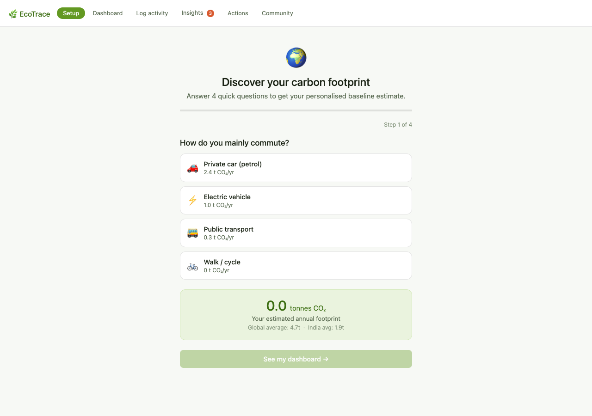
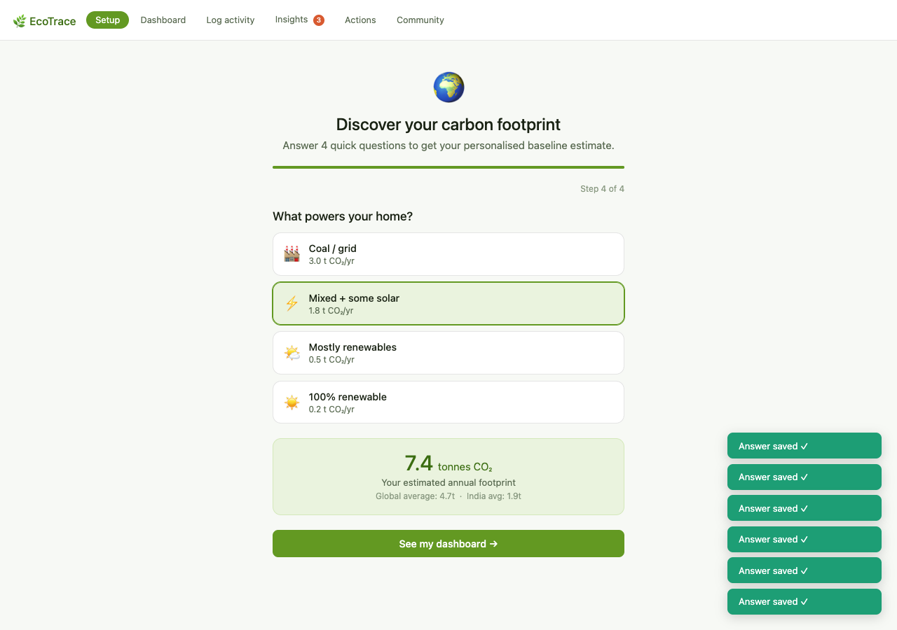
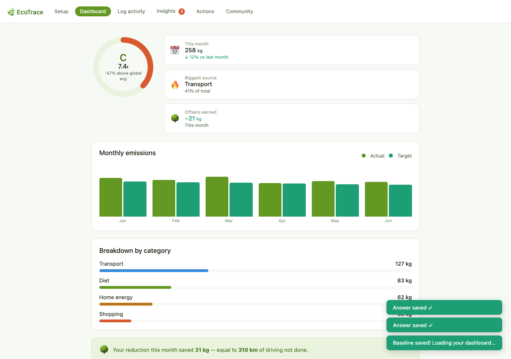
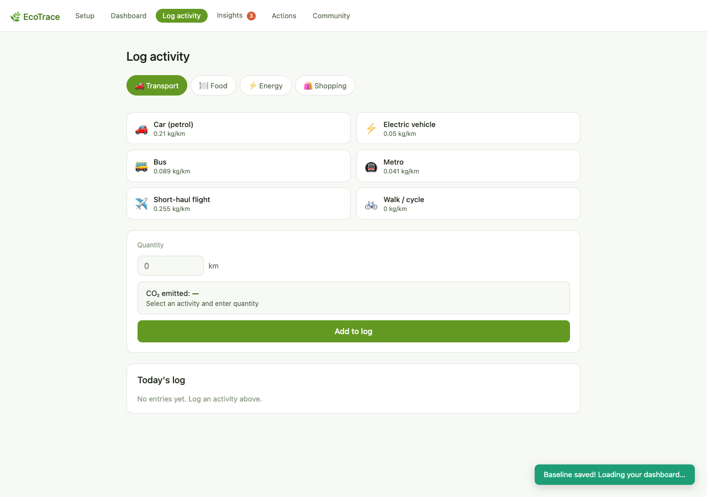
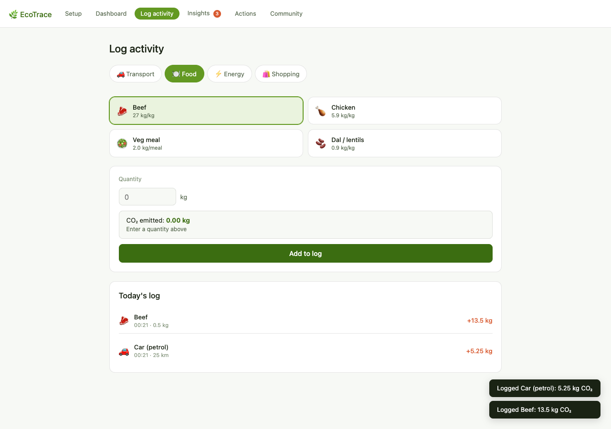
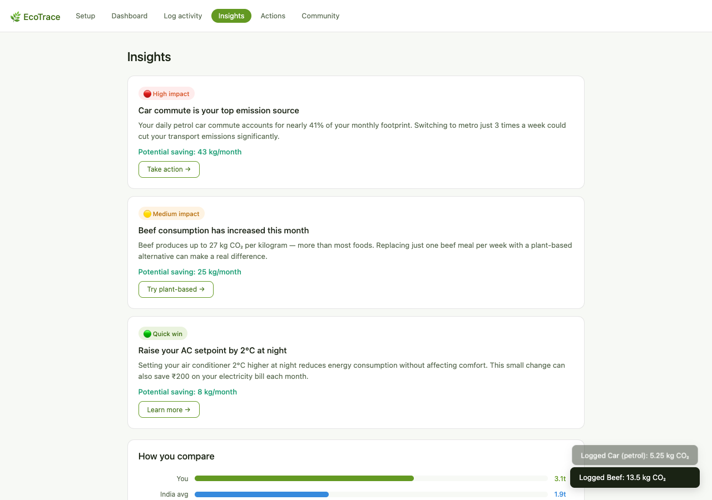
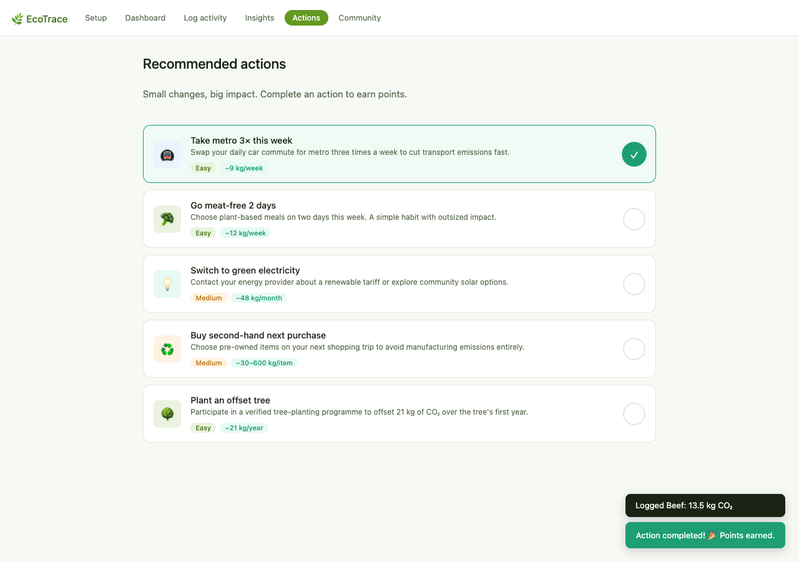
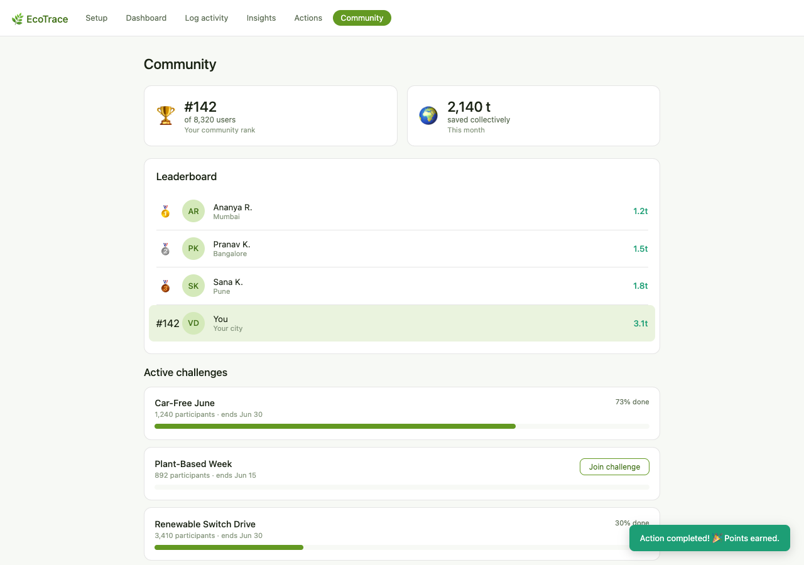

# 🌱 EcoTrace — Carbon Footprint Awareness Platform

> Empowering individuals to understand, track, and reduce their carbon emissions through data-driven insights and sustainable actions.


---

## 📌 Overview

EcoTrace is a web-based Carbon Footprint Awareness Platform designed to help users measure and understand the environmental impact of their daily lifestyle choices.

The platform calculates estimated carbon emissions from transportation, energy usage, and consumption habits, then provides actionable recommendations to reduce emissions and promote sustainable living.

This project aligns with **United Nations Sustainable Development Goal (SDG) 13 – Climate Action** by encouraging environmental awareness and responsible decision-making.

---

## 🎯 Problem Statement

Many people contribute to carbon emissions without understanding the impact of their daily activities.

EcoTrace addresses this challenge by:

- Making carbon emissions visible
- Providing easy-to-understand insights
- Encouraging eco-friendly behavior
- Promoting climate awareness

---

## ✨ Features

### 📊 Carbon Footprint Calculator
Calculate estimated CO₂ emissions based on:

- Transportation habits
- Energy consumption
- Lifestyle choices

### 📈 Visual Analytics
Interactive charts and statistics to visualize:

- Personal carbon footprint
- National averages
- Global averages
- Sustainability targets

### 🌍 Sustainability Recommendations
Receive personalized suggestions such as:

- Using public transport
- Switching to renewable energy
- Planting trees
- Reducing meat consumption

### 🏆 Community Engagement
- Sustainability leaderboard
- Eco challenges
- Environmental awareness campaigns

### 📚 Educational Insights
Learn about:

- Climate change
- Carbon emissions
- Sustainable practices
- Environmental responsibility

---

## 🛠️ Tech Stack

| Technology | Purpose |
|------------|----------|
| HTML5 | Structure |
| CSS3 | Styling & Responsive Design |
| JavaScript (ES6) | Application Logic |
| GitHub Pages | Deployment |

---

## 📂 Project Structure

```text
Carbon-Footprint/
│
├── index.html
├── style.css
├── app.js
├── README.md
│
└── assets/
```

---

## 🚀 Getting Started

### Clone Repository

```bash
git clone https://github.com/vedantdubey19/Carbon-Footprint.git
```

### Open Project

```bash
cd Carbon-Footprint
```

Open:

```text
index.html
```

in your browser.

---

## 📸 Screenshots

### Onboarding Quiz
Before using the dashboard, users take a 4-step interactive quiz to establish their baseline annual carbon footprint.

| Step 1: Commuting Habits | Completed Baseline Estimate |
| :---: | :---: |
|  |  |

### Dashboard
Once the baseline is set, the main dashboard provides a score grade, monthly emissions tracking, your primary source of emissions, and carbon offsets earned.



### Carbon Analysis & Activity Logging
Users can log daily actions under Transport, Food, Energy, and Shopping. Emissions are calculated in real-time, and daily logs are stored locally.

| Empty Activity Log | Active Daily Log |
| :---: | :---: |
|  |  |

### Sustainability Recommendations & Actions
Personalized insights offer quick wins and high-impact suggestions, which users can mark as completed in their interactive action checklist.

| Tailored Insights | Recommended Actions |
| :---: | :---: |
|  |  |

### Community Engagement
Users can view the local leaderboard and participate in group sustainability challenges like "Car-Free June".



---

## 🧠 How It Works

1. User enters lifestyle information
2. System estimates CO₂ emissions
3. Results are compared with:
   - National Average
   - Global Average
   - Climate Targets
4. Personalized sustainability suggestions are generated
5. User can participate in eco challenges

---

## 🌎 Environmental Impact

EcoTrace helps users:

- Understand personal emissions
- Reduce carbon footprint
- Develop sustainable habits
- Contribute to climate action goals

---

## 🎖️ PromptWars Submission

### Vertical

Climate Tech / Sustainability

### Challenge

Build an innovative solution that promotes environmental awareness and sustainability.

### Solution

EcoTrace transforms complex environmental data into simple, actionable insights that help individuals make environmentally responsible decisions.

---

## 🔮 Future Improvements

- AI-powered recommendations
- User authentication
- Carbon footprint history tracking
- Mobile application
- Real-time emission APIs
- Gamification and rewards
- Social sharing

---

## 👨‍💻 Author

**Vedant Dubey**

- GitHub: https://github.com/vedantdubey19
- LinkedIn: Add your LinkedIn URL

---

## ⭐ Support

If you found this project useful:

⭐ Star this repository

🍴 Fork the project

📢 Share it with others

---

## 📄 License

This project is licensed under the MIT License.
